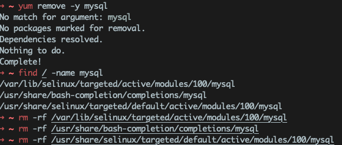
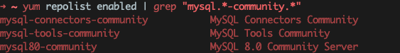
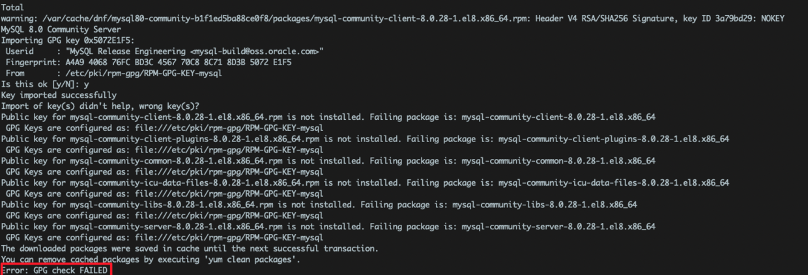
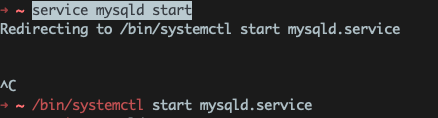
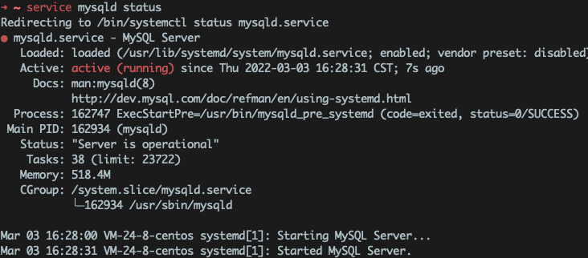
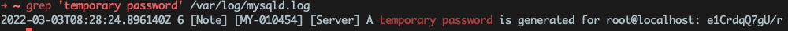
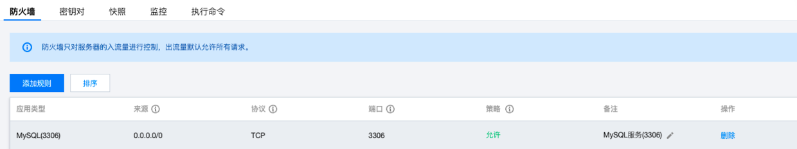

1、卸载之前yum源的版本
代码如下，执行如图
```bash
yum remove -y mysql
find / -name mysql  #找到残留的文件，再通过rm -rf去删除对应的文件
rm -rf 
```


2、下载安装
```bash
wget https://dev.mysql.com/get/mysql80-community-release-el8-1.noarch.rpm

yum install mysql80-community-release-el8-1.noarch.rpm
```

3、检查数据源
```bash
yum repolist enabled | grep "mysql.*-community.*"
```


4、禁用centos8自带mysql模块
```bash
yum module disable mysql
```

5、安装mysql

```bash
yum install mysql-community-server
yum install mysql80-community-release-el8-1.noarch.rpm
```
这里我报错了，错误信息如下：


      Error:GPG check FAILED。
这由于源key错误导致的dnf或者yum（软件包管理器）安装软件失败。<br/>

解决的方法很简单，

```bash
#yum install packagemame --nogpgcheck
yum install mysql-community-server --nogpgcheck
```

6、启动mysql
```bash
service mysqld start
```
这里有问题


需要执行
```bash
/bin/systemctl start mysqld.service
```

查看一下状态
```bash
service mysqld status
```


7、查看临时密码
就是root@localhost后面的那段
```
grep 'temporary password' /var/log/mysqld.log
```


8、登录修改密码
```sql
mysql -u root -p上面生成的密码
#修改密码
ALTER USER 'root'@'localhost' IDENTIFIED BY 'Root_123456';
#第一次要按照大小写_数字的格式，不然会报错
#ERROR 1819 (HY000): Your password does not satisfy the current policy requirements
#查看密码策略
SHOW VARIABLES LIKE 'validate_password%';
#修改密码长度
set global validate_password.length=1; //（长度）
#修改密码等级
set global validate_password.policy=0; //（等级）
#设置自己想要的密码
ALTER USER 'root'@'localhost' IDENTIFIED BY '123456';
#查看现在密码策略
SHOW VARIABLES LIKE 'validate_password%';

#Mysql8.0.22开放远程访问
#创建权限用户记录
create user 'root'@'%' identified by '123456';
#授权
grant all privileges on *.* to 'root'@'%' with grant option;
```

9、开放防火墙端口
直接在安全组开放mysql端口号



