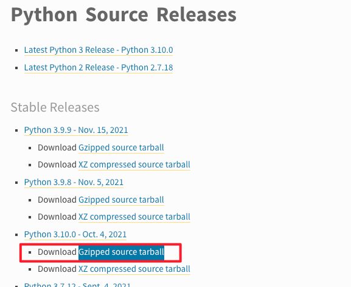

说明：我买的是腾讯云的轻量服务器，选的centos8，但没有预装的python，所以才下载python3，如果有python2的，注意原始/usr/bin/下的调用

## 1、安装python3.10所需的依赖
```bash
yum -y install zlib-devel bzip2-devel openssl-devel ncurses-devel sqlite-devel readline-devel tk-devel libffi-devel gcc make
```

> 这里有个坑......算是我自己导致的，我之前下载的clash代理，导入了http_proxy和https_proxy变量为127.0.0.1:7890，导致访问腾讯云的包502错误，我把导入变量清空掉，重新连接ssh就可以下载了，记录todo，后续看下什么原因

> 大致因为，我的代理只能分配打到了Others配置组，但Others配置组，我配置的是Porxy模式，所以连接有问题，改成Domestic就可以了
msg="[TCP] 127.0.0.1:37258 --> mirrors.tencentyun.com:80 match Match() using Others

## 2、下载解压python
linux下面，下载这个


```bash
wget https://www.python.org/ftp/python/3.10.0/Python-3.10.0.tgz
tar -xvf Python-3.10.0.tgz
cd Python-3.10.0
```
我的wget命令是建立在/root/tools/下面的，记住这个位置

## 3、编译

```bash
./configure --prefix=/root/tools/Python-3.10.0

```

注：
这里–prefix是指定编译安装的文件夹，对应上面我们安装的文件夹路径<br/>

执行完上一步后会提示执行以下的代码对Python解释器进行优化，执行该代码后，会编译安装到 /usr/local/bin/ 下，且不用添加软连接或环境变量


```bash
./configure --enable-optimizations
make && make install
```
升级pipe
```bash
pip3 install --upgrade pip
```
至此安装完成，也可以添加软链，终端输入python或python3效果一样，如果有python2的，这里可能就被替换掉了，python2如果系统原来自带，尽量不要删除，有些系统依赖需要python2
```bash
ln -sf /usr/local/bin/python3 /usr/bin/python
```
