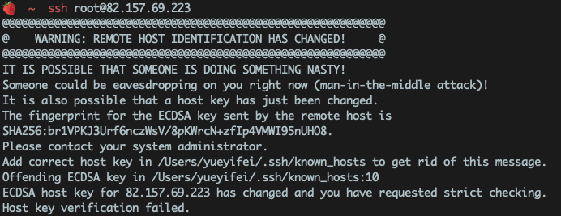

报错如下：

解决方案：

在终端上输入以下命令：  "你的远程服务器ip地址"

目的是：清除你当前机器里关于你的远程服务器的缓存和公钥信息，注意是大写的字母“R”。

原因分析：根据个人的情况，原因是我的云服务器重装了系统（清除了与我本地SSH连接协议相关信息），本地的SSH协议信息便失效了。SSH连接相同的ip地址时因有连接记录直接使用失效的协议信息去验证该ip服务器，所以会报错，使用上述命令便可以清除known_hosts里旧缓存文件。

延伸：远程服务器的ssh服务被卸载重装或ssh相关数据（协议信息）被删除也会导致这个错误。
